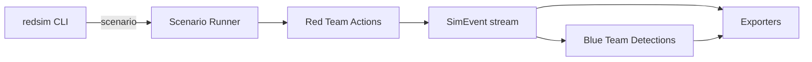

# RedSim v2 - Purple Team Simulation Framework

RedSim v2 is a lightweight, local simulation framework for purple team workflows. It produces structured red-team events and matching blue-team detections so you can prototype detection logic, validate telemetry flows, and document your adversary emulation approach.

## Highlights
- Structured event model with MITRE ATT&CK technique mapping
- Scenario runner that produces red and blue events
- Scenario definitions in JSON/YAML with validation
- Simple rule-based detection stubs (extendable)
- CLI output in JSON for tooling and pipeline integration
- Exporters for SIEM, Sigma-like, and metrics output
- Example script and basic tests
- CI with lint, formatting, and coverage

## Quickstart
Install dependencies (YAML support):

```bash
python -m pip install -r requirements.txt
```

Optional dev tools (lint/format/coverage):

```bash
python -m pip install -r requirements-dev.txt
```

Install as editable package:

```bash
python -m pip install -e .
```

Run the basic scenario and print JSON output:

```bash
python -m redsim.cli --scenario basic --pretty
redsim --scenario basic --pretty
```

Run a scenario defined in JSON or YAML:

```bash
python -m redsim.cli --scenario-file scenarios/basic.json --pretty
python -m redsim.cli --scenario-file scenarios/basic.yaml --pretty
python -m redsim.cli --scenario-file scenarios/enterprise.json --pretty
```

List available scenarios:

```bash
python -m redsim.cli --list-scenarios
```

Included scenarios:
- `basic` (built-in)
- `enterprise` (JSON/YAML in `scenarios/`)

Export in SIEM, Sigma-like, or metrics format:

```bash
python -m redsim.cli --scenario basic --format siem --pretty
python -m redsim.cli --scenario basic --format sigma --pretty
python -m redsim.cli --scenario basic --format metrics --pretty
```

Run tests:

```bash
python -m unittest discover -s tests
```

Quality checks:

```bash
ruff check .
black --check .
coverage run -m unittest discover -s tests
coverage report -m
```

## Flow (high level)


## Example Output (trimmed)
See a generated sample at `examples/output_basic.json`.

```json
{
  "scenario": "basic",
  "red_events": [
    {
      "event_id": "system_info_discovery",
      "timestamp": "2026-03-11T19:24:12Z",
      "side": "red",
      "tactic": "Discovery",
      "technique_id": "T1082",
      "technique_name": "System Information Discovery",
      "description": "Collected basic host information",
      "metadata": {
        "os": "Windows",
        "hostname": "LAB-01",
        "user": "analyst",
        "architecture": "AMD64"
      }
    }
  ],
  "blue_events": [
    {
      "event_id": "DET-002",
      "timestamp": "2026-03-11T19:24:12Z",
      "side": "blue",
      "tactic": "Detection",
      "technique_id": "T1082",
      "technique_name": "System Information Discovery",
      "description": "System information discovery observed",
      "metadata": {
        "source_event_id": "system_info_discovery"
      }
    }
  ]
}
```

## Project Structure
- `agent/` red team simulation modules
- `blue_team/` detection stubs
- `redsim/` core models, technique mapping, CLI, and scenario runner
- `scenarios/` JSON/YAML scenario definitions
- `examples/` usage examples
- `tests/` basic unit tests

## Design Notes
- All outputs are simulated and safe for local use. No offensive code or live network operations.
- Event schemas are consistent to simplify downstream parsing.
- Detection logic is rule-based to keep the baseline understandable; extend with scoring or analytics as needed.
- YAML scenarios require `PyYAML` (see `requirements.txt`).

## Roadmap Ideas
- Pluggable detection rules and severity scoring
- Replay support and deterministic runs
- Sigma rule export in YAML and ECS pipeline examples

## Disclaimer
This project is intended for defensive testing, purple team collaboration, and education. Do not use it for unauthorized activity.
